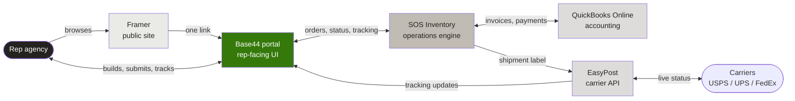
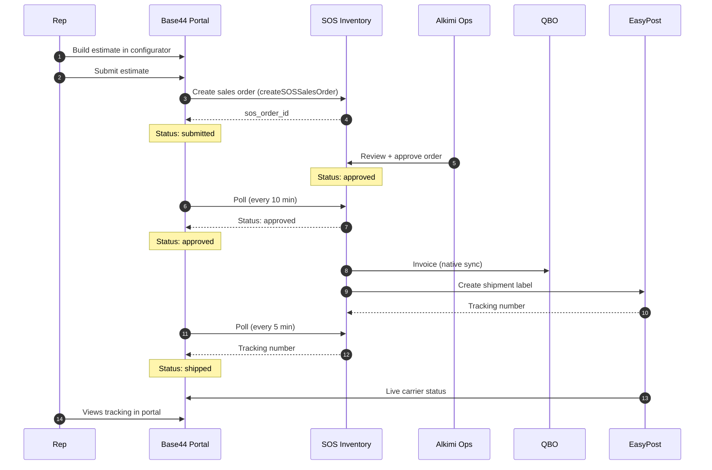

# Alkimi — Stack & Order Flow
*Internal alignment doc — May 2026*

---

## 1. The stack at a glance

**Key principle:** the rep only ever touches Framer (marketing) and Base44 (portal). Everything else is invisible.

---

## 2. Order flow — happy path

---

## 3. Polling tiers (the freshness contract)

SOS has no outgoing webhooks, so Base44 polls SOS on a cadence that matches what the rep actually cares about at each stage. Plus a **foreground refresh** every time the rep opens a project — gives near-real-time updates when they're actively watching.

| Project state | Background poll | Rep latency (background) | Rep latency (active) |
|---|---|---|---|
| Submitted (awaiting approval) | 10 min | ≤ 10 min | < 1 sec |
| Approved (awaiting fulfillment) | 30 min | ≤ 30 min | < 1 sec |
| In fulfillment (awaiting tracking) | 5 min | ≤ 5 min | < 1 sec |
| Shipped | 60 min | ≤ 60 min | < 1 sec |
| Delivered / closed | none | — | — |

---

## 4. What each tool owns

| Tool | Owns | Rep sees? |
|---|---|---|
| **Framer** | Public marketing site, brand story | Yes (public) |
| **Base44** | Configurator, dashboards, tracking page, order history, auth | Yes |
| **SOS Inventory** | Sales orders, fulfillment workflow, physical inventory at ReadySpace NYC, shipments | No |
| **QuickBooks Online** | Books, invoices, payments | No |
| **EasyPost** | Carrier API translation, live tracking status | No (data surfaces in Base44) |

---

## 5. Build status

```mermaid
flowchart LR
    subgraph Done [✅ Already built]
        A[Base44 configurator<br/>projects, tape runs, drivers]
        B[QBO connection]
        C[SOS account + API creds]
        D[Entity schemas]
    end

    subgraph Building [🔨 In progress]
        E[Configurator polish + portal pages]
    end

    subgraph Next [⏳ Next up]
        F[Base44 → SOS submission flow]
        G[SOS → Base44 polling reconcile]
        H[Base44 → QBO invoice on approval]
        I[EasyPost setup + tracking page]
        J[Seed Alkiline SKUs into SOS]
        K[Rep dashboard, order status, tracking pages]
    end

    Done --> Building --> Next
```

---

## 6. Order of operations (what we build when)

1. **Finalize the configurator** (90% done — open audit items + polish)
2. **Spec rep dashboard + Alkimi approval queue** (sketch, don't build yet)
3. **SOS integration** — `createSOSSalesOrder` (push), `reconcileSOSOrders` (background poll), `fetchSOSOrderStatus` (foreground refresh)
4. **EasyPost + tracking page** — depends on SOS shipment data flowing
5. **Pre-launch tabletop** — walk through every failure mode (SOS down, token expiry, address validation fail, etc.) and build graceful fallbacks

---

## 7. Strategic principles

- **Discipline about what we build vs. assemble.** We're not rebuilding inventory, accounting, or carrier APIs. We're building one beautiful portal and a thin layer of glue.
- **The rep portal is the brand.** Every UX decision should feel premium and effortless.
- **One source of truth per concept.** Product catalog lives in SOS. Books live in QBO. Customer-facing state lives in Base44. No duplicated databases.
- **Graceful degradation by default.** When SOS is slow or down, the rep should see a friendly "syncing" indicator, not a broken portal.
- **Observability over assumption.** Every project carries `last_sos_sync_at` and `last_sos_sync_error` so we can find issues in seconds, not minutes.

---

## 8. Open architectural decisions

- **SOS vs. Cin7 Core?** Cin7 has native webhooks (real-time approval + tracking notifications); SOS does not. Cin7 costs ~$300–500/mo more. **Current plan: stay on SOS, use the polling+foreground-refresh pattern. Revisit post-launch if 5-min latency feels painful.**
- **Webhooks vs. polling?** Polling (SOS has no webhooks). Polling cadence tuned per status to balance freshness vs. API budget.
- **Customer-matching in SOS** — current `createSOSSalesOrder` sends `customer: { name }` only. Needs real customer upsert logic before launch.
- **Multi-rep agencies** — permission model not yet decided. Likely needs row-level security on `Project` scoped to agency, not individual rep.

---

*Last updated: 2026-05-20*
